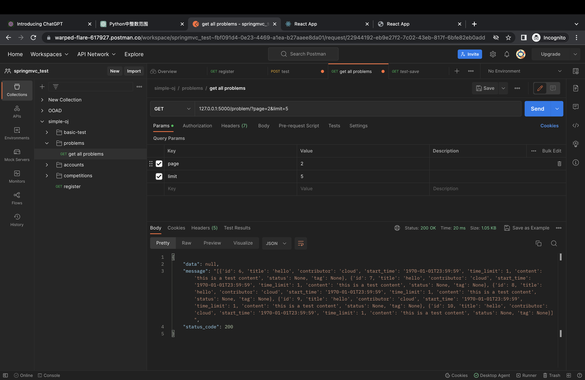
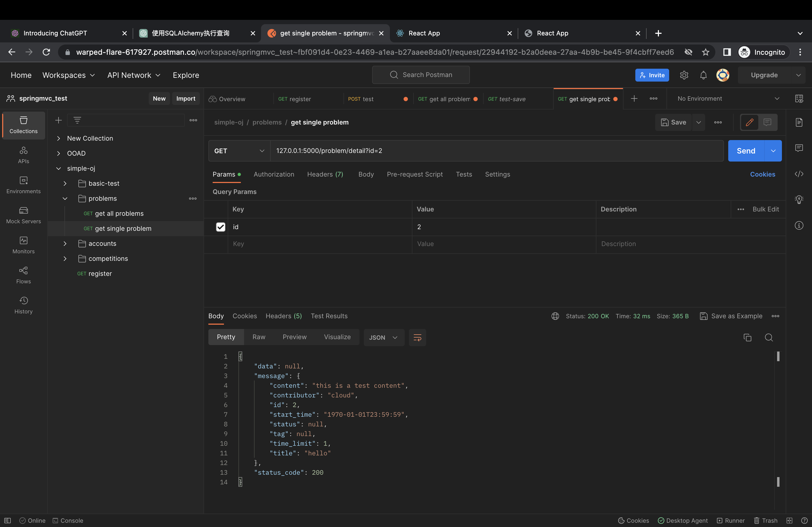
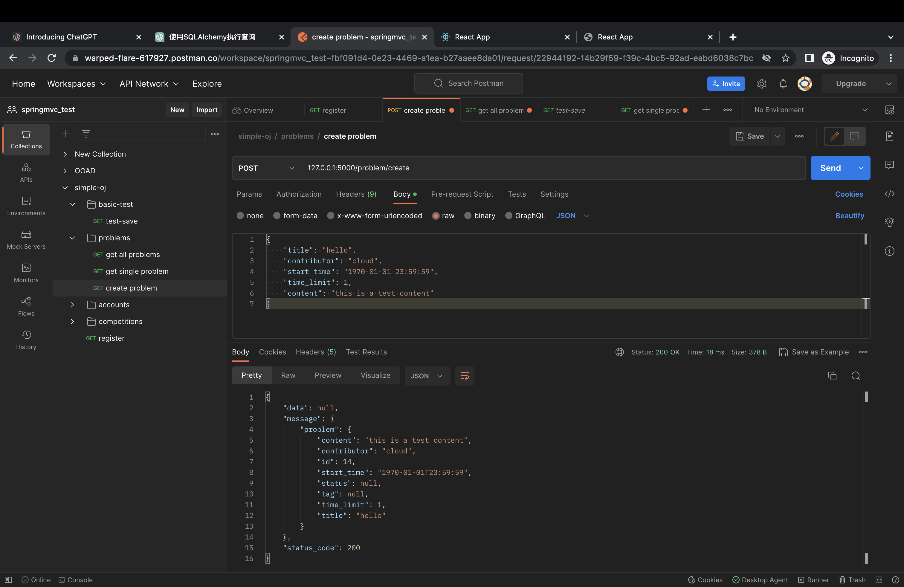

# backend document

---

### 0. setup

1. use mysql, url: `localhost:3306/oj'`
2. python backend env

```shell
conda create -n webenv python=3.10
conda activate webenv
conda install -c conda-forge flask=2.2.3
conda install -c conda-forge pydantic=1.10.5
pip3 install -r requirements.txt
```

---

### 1. Overview

#### 1.1 Response

返回给前端的类, ==截图仅供参考! 重新在本机测试!==

```js
{
    "data"
:
    self.data,
        // 返回数据
        "status_code"
:
    self.status_code,
        "message"
:
    self.message
    // 表示状态的信息(not found, invalid...)
}
```

#### 1.2 User

1. user拥有三个权限
   level1: ”学生“用户, level2: ”老师“用户, level3: super user
2. username: 用户名, nickname: 用于展示的昵称

#### 1.3 json格式

1. `to_json_lite`: 不带object名, 数组中使用
   ```js
   [
       {
           //obj1...
       },
       {
           //obj2...
       }
   ]
   ```
2. `to_json`: 带object名, 其它情况使用
   ```js
   // 放入 Response message 中的 problem 对象
   "message": {
       "problem": {
           //content...
       }
   }
   ```

#### 1.4 时间格式

使用 `datetime.datetime`, `isoformat()`

---

### 2. Problem

0. 获取题目列表 / 单个题目, 老师创建题目
   contributor: nickname
   start_time: 题目创建时间
   status: 预留值
   tag: 预留标签

1. get all problems
   
2. get single problem
   
3. create problem
   

---

### 3. Submit (code)

1. create submit

2. get all submit histories

3. get submit histories of somebody

4. get submit histories of specific question
5. get submit histories of specific question of somebody

---


